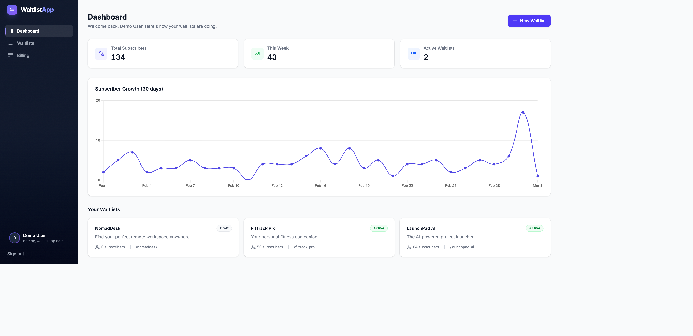
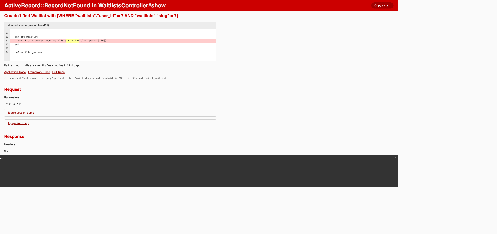
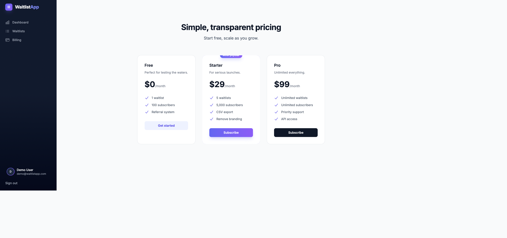
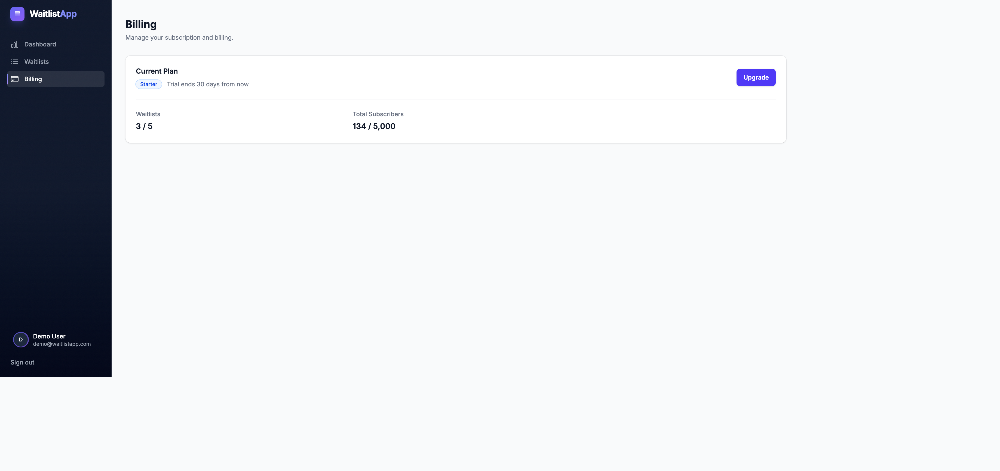

<div align="center">

# WaitlistApp

### Viral waitlists with built-in referral mechanics


</div>

---

A production-grade SaaS for creating viral waitlists with built-in referral mechanics. Built with Rails 8, SQLite, and the "Midnight Aurora" design system.


## What It Does

WaitlistApp lets you launch a waitlist for any product in under 2 minutes. Each subscriber gets a unique referral link - when their friends sign up through it, the referrer moves up in line. This creates a viral loop that drives organic growth.

**Core flow:** Create waitlist → Share public page → Subscribers join → Get referral link → Share with friends → Move up the list

## Screenshots

<table>
  <tr>
    <td></td>
    <td></td>
  </tr>
  <tr>
    <td align="center"><strong>Analytics Dashboard</strong></td>
    <td align="center"><strong>Waitlist Management</strong></td>
  </tr>
  <tr>
    <td></td>
    <td></td>
  </tr>
  <tr>
    <td align="center"><strong>Public Waitlist Page</strong></td>
    <td align="center"><strong>Post-Signup Referral Link</strong></td>
  </tr>
  <tr>
    <td></td>
    <td></td>
  </tr>
  <tr>
    <td align="center"><strong>Pricing Tiers</strong></td>
    <td align="center"><strong>Billing Dashboard</strong></td>
  </tr>
</table>

## Tech Stack

| Layer | Technology |
|-------|-----------|
| Framework | Rails 8.1.2 / Ruby 4.0.1 |
| Database | SQLite3 (WAL mode, PRAGMA-tuned) |
| Background Jobs | Solid Queue (3 priority queues) |
| Caching | Solid Cache + HTTP caching |
| Real-time | Solid Cable + Turbo Streams |
| CSS | Tailwind CSS 4 with custom theme |
| JS | Stimulus + importmap-rails |
| Charts | Chartkick + Chart.js |
| Deployment | Kamal + Docker |
| Payments | Stripe (Checkout + Webhooks) |
| Error Tracking | Sentry |
| Rate Limiting | Rack::Attack + Rails rate_limit |

## Architecture

```
app/
├── models/          # 6 models (User, Waitlist, Subscriber, Referral, DailyStat, Session)
├── controllers/     # 12 controllers including webhooks
├── jobs/            # 7 background jobs (email, analytics, export, maintenance)
├── views/           # Tailwind-styled ERB with Turbo Frames
├── helpers/         # Design system + meta tags + sidebar helpers
└── javascript/      # 6 Stimulus controllers (clipboard, counter, sidebar, etc.)
```

### Key Design Decisions

- **SQLite over Postgres** - Zero-ops deployment, WAL mode handles concurrent reads during writes, PRAGMA-tuned for SaaS workloads (128MB mmap, 20MB page cache)
- **Position swap on referral** - When a referrer moves up, they swap positions with the occupant instead of shifting the entire list. O(1) instead of O(n)
- **Buffered page views** - Page views increment in Rails.cache, flushed to DB every 5 minutes via recurring job. Eliminates write contention on hot path
- **SQL upsert for daily stats** - Single `INSERT ... ON CONFLICT UPDATE` instead of find-or-create + increment (2 queries → 1, race-condition-free)

## Setup

```bash
git clone https://github.com/stussysenik/waitlist-app.git
cd waitlist-app
bin/setup
bin/rails db:seed     # Creates demo user + 3 waitlists with 80+ subscribers
bin/dev               # Starts Rails + Tailwind watcher + Solid Queue
```

Open [localhost:3000](http://localhost:3000) and sign in with:
- **Email:** `demo@waitlistapp.com`
- **Password:** `password123`

### Requirements

- Ruby 4.0+
- Node.js (for Tailwind CSS build)

## Development

```bash
bin/dev                       # Start all processes
bin/rails test                # Run test suite
bin/rails db:migrate          # Run pending migrations
bin/rails runner 'puts Subscriber.count'  # Console queries
```

### Background Jobs

Jobs run inline in development by default. To test with Solid Queue:

```bash
bin/jobs                      # Start Solid Queue worker
```

Three queues by priority: `critical` (emails) → `default` (exports) → `analytics` (stats)

### Recurring Jobs

| Job | Schedule | Purpose |
|-----|----------|---------|
| ProcessAnalyticsJob | Daily 2am | Aggregate daily stats per waitlist |
| FlushPageViewsJob | Every 5 min | Flush cached page views to DB |
| SqliteMaintenanceJob | Daily 3am | ANALYZE + PRAGMA optimize |
| CleanupSessionsJob | Weekly | Purge sessions older than 30 days |

## Performance

SQLite configured for high-throughput SaaS workload:

```yaml
# config/database.yml
pragmas:
  journal_mode: wal         # Concurrent reads during writes
  synchronous: normal        # Safe with WAL, skips extra fsync
  mmap_size: 134217728       # 128MB memory-mapped I/O
  cache_size: -20000         # 20MB page cache
  busy_timeout: 5000         # Wait instead of failing on lock
```

Query optimizations:
- Composite indexes on `(waitlist_id, created_at)` for time-range queries
- `counter_cache` on referrals for O(1) count lookups
- `dependent: :delete_all` instead of `:destroy` to avoid loading records
- Dashboard queries cached with 5-15 minute TTL

## Security

- **Rate limiting:** Rack::Attack (300 req/5min global, 10 subscribe/hr per IP) + Rails `rate_limit` (5 subscribe/min)
- **Content Security Policy:** Configured in report-only mode
- **Input validation:** Brand color regex, slug format constraints, email normalization
- **Session security:** HttpOnly, SameSite: Lax, Secure in production
- **SSL:** `force_ssl` + `assume_ssl` in production
- **Secrets:** credentials.yml.enc for API keys, .env gitignored

## Deployment

Configured for Kamal deployment with Docker:

```bash
bin/kamal setup              # First deploy
bin/kamal deploy             # Subsequent deploys
```

Docker entrypoint runs `PRAGMA journal_mode=wal` on all SQLite databases before Rails boots.

Production Puma config: multi-worker with `preload_app!` and automatic worker count based on CPU cores.

## License

Private repository. All rights reserved.
